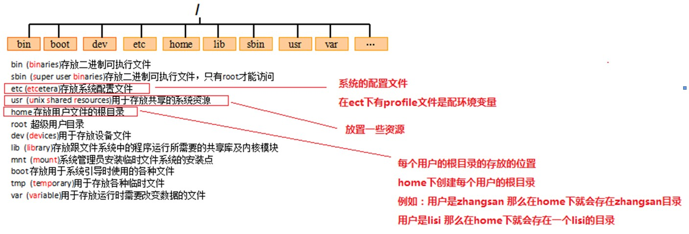
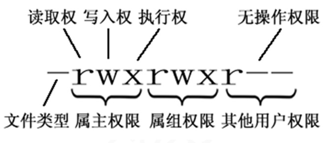

# Linux操作

今日目标

1. Linux系统概述与由来
2. Linux应用场景
3. 熟练使用虚拟机技术
4. 安装Linux版本之CentOS
5. 熟练使用磁盘管理命令
6. 熟练使用文件管理命令
7. 熟练使用文档编辑命令
8. 熟练使用备份压缩命令
9. 熟练使用权限命令
10. Linux其他系统命令

# 一、Linux操作系统概述

  Linux是基于Unix的开源免费的操作系统，由于系统的稳定性和安全性几乎成为程序代码运行的最佳系统环境。Linux是由Linus Torvalds（林纳斯·托瓦兹）起初开发的，由于源代码的开放性，现在已经衍生出了成千上百种不同的Linux系统。

  Linux系统的应用非常广泛，不仅可以长时间的运行我们编写的程序代码，还可以安装在各种计算机硬件设备中，比如手机、平板电脑、路由器等。尤其在这里提及一下，我们熟知是Android程序最底层就是运行在linux系统上的。

## 1. Linux应用场景

服务端：Web服务器、数据库服务器、负载均衡服务器、邮件服务器、DNS服务器

用户端：生活中的手机、平板、智能电视大部分基于安卓系统，安卓系统底层是linux

## 2. Linux分类

### 按用途不同分类：

- 家庭用途：带有图形界面窗口，注重用户体验，类似window操作系统，但目前成熟度不够。
- 商业服务用途：没有好看的界面，是以在控制台窗口中输入命令操作系统的，类似于DOS，是我们架设服务器的最佳选择。

### 按发行家族分类：

- 内核版本（Linux kernel）：在Linus领导下的内核小组开发维护的系统内核的版本号。内核开发主要快速支持出现的硬件产品

  内核负责实现操作系统的核心功能，内核不包括应用程序。

  内核开发涉及存储管理、CPU和[进程管理](https://baike.baidu.com/item/%E8%BF%9B%E7%A8%8B%E7%AE%A1%E7%90%86)、文件系统、设备管理和驱动、网络通信，以及系统的初始化（引导）、系统调用等。

- 发行版本：一些组织或公司在内核版(Linux kernel)基础上进行二次开发而重新发行的版本。

  操作系统是把内核和一些常用的应用程序打包在一起提供给普通用户，这就是操作系统的发行版（也就是普通意义上的操作系统）。

  - Linux发行版本不同，又可以分为n多种：

## 3. Linux目录结构

所有内容都是在根目录下

重点目录： root、home 、etc、usr、mnt、tmp

# 二、Linux系统操作

## 1. 磁盘目录查看

- pwd 显示当前在哪个目录	

- clear 清屏

- ls：查看目录

  - 参数 -a 显示全部，包含隐藏
  - 参数 -l 列表形式显示  

  ls -l   列表展示

  + “d”开头是目录，
  + “-” 开头是文件，
  + “l” 开头是链接文件

  ls -a 查看隐藏文件

  + .  开头的是隐藏文件或目录

  ls -la   列表展示，包含隐藏文件  简写命令是  ll -a 。

## 2.目录切换命令

- cd usr        切换到该目录下usr目录

- cd ..         切换到上一层目录

- cd /           切换到系统根目录

- cd ~ （波浪号 tilde）         切换到用户主目录

- cd -           切换到上一个所在目录

  注意：

  + 绝对路径:  从根开始的，都称为绝对路径

     cd  /etc:  进入根目录下的etc  

  + 相对路径：从当前开始的，都称为相对路径

    cd  etc:    进入当前目录下的etc  :     

    cd ./etc    同上

    cd ../root  进入当前上一级目录 ，.. 代表上一级目录

  输入目录时，使用tab，系统会智能提示

## 3. 磁盘文件创建

### 创建空文件：touch

- touch：创建新文件命令  touch 文件名 默认创建的空文件。

### 添加内容到文件：echo 

- echo "内容" > a.txt  添加内容到文件，会覆盖
- echo "内容" >> a.txt 追加内容到文件，追加到尾部
- cat 文件  显示文件内容
- cat  a.txt >> b.txt  a文件追加到b文件

备注：

​     echo $变量  显示变量的值

## 4. 磁盘文件及目录操作

​       linux操作系统命令格式： 命令 -[参数]

### 增加：mkdir

mkdir 目录名字 [目录名列表]，效果如下：

+ mkdir  a   在当前下创建a
+ mkdir  test/a1 在 test下创建a1
+ mkdir  b c  d 在当前下同时创建  b、c、d目录

注意：不能跨级创建子目录

### 修改：mv

mv 文件或目录名 目标文件或目录名，效果如下：

+ 文件操作  mv  a.txt  b.txt  ： b.txt不存在即为重命名，存在会提示是否覆盖
+ 目录操作  mv  test   tmp   ：tmp不存在即为重命名，存在为移动效果
+ 文件对目录  mv  a.txt   ./tmp   移动文件到指定目录

### 复制：cp

 cp [参数] 源文件或目录，目标文件或目录

 参数: -r 递归

- 单文件操作   cp  a.txt  a.txt.bak 在当前下复制一个文件
- 多文件操作   cp ./web/*  ./test 把web下的所有文件复制到test下
- 递归操作       cp  -r ./web/*  ./test 把web下的所有文件及子目录复制到test下

### 删除：rm

rm [参数] 删除文件目录命令

参数:  -r  递归   -f 忽略询问

- rm  a.txt  删除当前下的文件，会询问提示

- rm -f a.txt 不询问直接删除

- rm -rf  ./test 递归删除test下的所有内容，包含test本身

- rm -rf ./test/*  递归删除test下的所有内容，但是test不删除

  注意：删除一个目录，必须是rm -rf，否则不能删除

### 搜索：find

find    搜索位置   -name 字符串

- find  /  - name  'java'  查java
- find / -name '*redis'  查找含有redis的

## 5. 磁盘文件及目录权限

### 权限概述

  权限是Linux中的重要概念，每个文件/目录等都具有权限，通过ls -l命令我们可以 查看某个目录下的文件或目录的权限

  示例：在随意某个目录下ls -l

- 文件的类型：
  - d：代表目录
  - -：代表文件
  - l：代表链接（可以认为是window中的快捷方式）
- 后面的9位分为3组，每3位置一组，分别代表属主的权限，与当前用户同组的     用户的权限，其他用户的权限
  - r：代表权限是可读，r也可以用数字4表示
  - w：代表权限是可写，w也可以用数字2表示
  - x：代表权限是可执行，x也可以用数字1表示

### 权限设置

语法：chmod  数字或符号权限  [参数]  文件或目录

- chmod u=rwx,g=rw,o=r aaa.txt
- chmod 750 -R 文件或目录名  递归授权  
- chmod 755 文件或目录  
- chmod 777 -R 文件或目录

## 6. 文件内容浏览

- cat命令 查看文件，只能显示文件最后一屏

  cat  a.txt  查看文件全部内容

  注意：

  cat除了查看文件内容，还可以把文件内容进行合并

  cat  a.txt >> b.txt 把a.txt文件输出到b.txt中

  比如：

  echo 'aaa' > a.txt

  echo 'bbb' > b.txt

  cat a.txt >> b.txt

- more命令查询文件：分页查看所有内容，带百分比

  显示文件百分比，回车下一行，空格下一页，退出是Q

- less命令查看文件：分页查看所有内容，带行号和百分比

  箭头上下代表上一行，下一行，空格显示下一页，退出是Q

  -N(大写) 显示行号

  -m 百分比

- head/tail命令查看文件，支持显示的文件行数

  head 查看文件头部 内容

  tail 查看文件尾部内容

  -n 数字  代表行数

  -f  实时持续查看文件内容

## 7. 文件内容编辑（vi/vim）

- vim：文件名

    适合快速修改纯文本文件，比如配置文件、属性文件、源文件等

- vim编辑器有三种模式

  命令模式、编辑模式、底行模式，按ESC，退出当前模式，进入命令模式。

  - 命令模式

      刚刚进入是命令模式，从命令模式可进入编辑模式或底行模式。

      只接受命令关键字  其他字符不接受，通过输入相应的命令可以进入编辑模式

      dd:删除当前行

      yy:复制当前行

      p:粘贴

      整页翻页 ctrl-f、 f是forword ， ctrl-b   b就是backward

      [shift](https://www.baidu.com/s?wd=shift&tn=SE_PcZhidaonwhc_ngpagmjz&rsv_dl=gh_pc_zhidao)+$是移动到行尾，0是移动到行首

  - 编辑模式

    进入编辑模式命令：i，o，a或者insert

    对文件进行内容编辑 任何字符都接受，内容编辑完毕之后 需要退回命令模式

    退回到命令模式，按ESC键

  - 底行模式

    在命令模式下，输入冒号 : ，进入底行模式。 

    底行命令：

    + :wq，写入并退出，

    + :q! ，退出不保存
    + :set nu，显示行号 
    + :set nu!，取消行号显示
    + :数字，定位行号
    + :/  搜索字符，n是下一个，N是上一个

- vim编辑器使用过程关于vim使用过程：

    vim 文件-------->命令模式--------->输入i---------->编辑模式----------->编辑文件----------->按下Esc--------->命令模式--------->按下：---------->底行模式----------->输入wq保存并退出/q！强制退出不保存

## 8. 压缩文件管理

  Linux中的打包文件一般是以.tar结尾的，压缩的命令一般是以.gz结尾的。而一般情况下打包和压缩是一起进行的，打包并压缩后的文件的后缀名一般.tar.gz。

### tar命令：压缩和解压缩

- 参数：-z 调用gzip压缩命令压缩

- 参数：-c 打包文件
- 参数：-C 在指定的目录解压缩

- 参数：-v 显示命令的执行过程

- 参数：-f 指定文件名
- 参数：-x 解压缩
- 示例：将test目录打成压缩包，压缩后文件名为 test.tar.gz
  -  tar -zcvf test.tar.gz test
- 示例：将test.tar.gz进行解压缩
  - tar -xvf test.tar.gz
  - tar -xvf test.tar.gz -C /usr/local   解压缩到指定的目录

### zip命令 压缩命令

 zip -r mydata.zip mydata #压缩mydata目录

 zip -r abc123.zip abc 123.txt  #把abc文件夹和123.txt压缩成为abc123.zip

### unzip    解压缩命令

​	unzip -d /a/b  filename.zip 将文件解压缩到/a/b目录里面

## 9.Linux系统命令

### 进程命令

#### ps命令：查看进程

- 参数：-e 显示所有程序

- 参数：-f 显示UID,PPIP

  ps -ef  显示所有进程

  UID      ：程序被该 UID(用户ID) 所拥有

  PID      ：就是这个程序的 ID

  PPID    ：则是其上级父程序的ID**

  C          ：CPU使用的资源百分比**

  STIME ：系统启动时间**

  TTY     ：登入者的终端机位置**

  TIME   ：使用掉的CPU时间。**

  CMD   ：所下达的是什么指令**

#### kill命令：结束进程

参数：-9 强制杀死该进程

### 过滤命令

grep [option] 字符串或正则表达式    文件名

从指定文件，搜索匹配的字符串

-i  忽略大小写 

- 示例：

  grep  -i test   /etc/sudo.conf   中包含字符串“test”的内容,且忽略大小写

  grep  '^d'       /etc/sudo.conf   查找以d开头的数据

  A命令 |B命令 | C命令

 将前一个命令的输出作为下一个命令的输入

 可以任意组合，只要是上一级有内容输出，下一个管道就可以处理

-  ll | grep '^d' | grep '.d$'| grep '4月'  
-  find / -name '*.log' | grep 'tomcat' 

### 网络命令

#### 查看IP

ifconfig    查看本机网络卡信息

#### 测试网络

ping   查看与某台主机的连接情况

#### 查看端口

netstat   查看本机被使用的端口号

参数：-a 显示所有连接

参数：-n 以网络IP地址代替名称

-t  显示tcp,   -u  显示udp连接情况

常用  

netstat -an  -t -u | grep '8080'

lsof -i tcp:3306 

### 重启关机命令

重启  reboot

关机 halt | shutdown