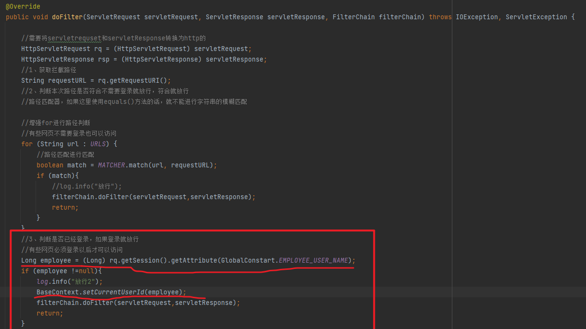
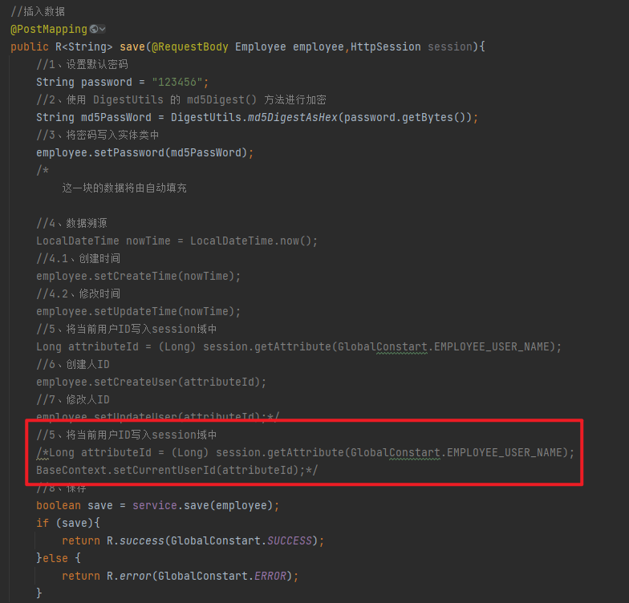
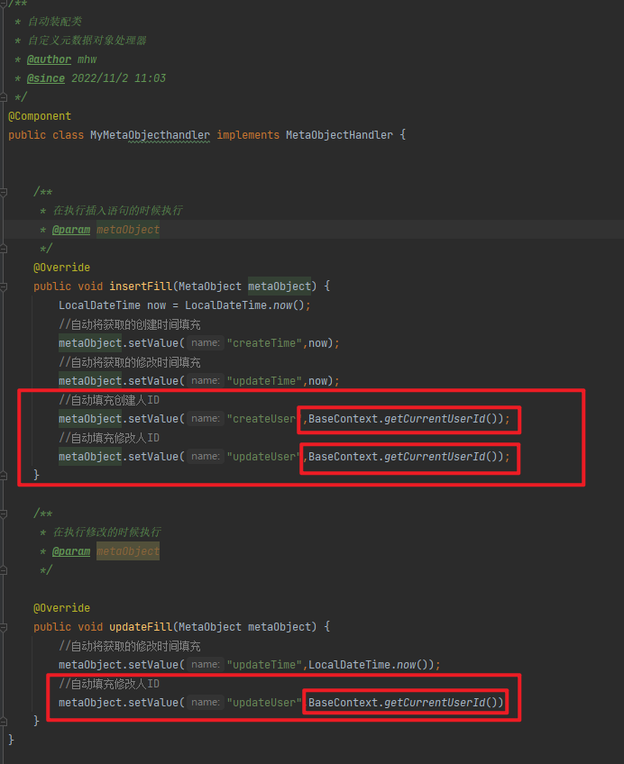
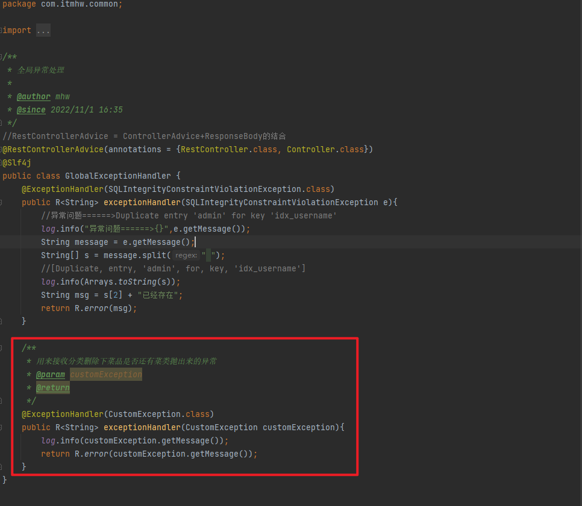

# 公共字段填充
## 数据溯源
```markdown
对于数据溯源来说，我们每次进行操作都得去书写一次，这样如果忘记书写，会导致出现问题，所以我们能不能让字段自己添加？
当然是可以的使用mybatisplus提供的公共字段填充功能就能处理也就是注解@tableField中的fill字段
```
```markdown
Mybatis Plus公共字段自动填充，也就是在插入或者更新的时候为指定字段赋予指定的值，使用它的好处就是可以统一对这些字段进行处理，避免了重复代码。
在上述的问题分析中，我们提到有四个公共字段，需要在新增/更新中进行赋值操作, 具体情况如下: 
```
| 字段名     | 赋值时机                    | 说明           |
| ---------- | --------------------------- | -------------- |
| createTime | 插入(INSERT)                | 当前时间       |
| updateTime | 插入(INSERT) , 更新(UPDATE) | 当前时间       |
| createUser | 插入(INSERT)                | 当前登录用户ID |
| updateUser | 插入(INSERT) , 更新(UPDATE) | 当前登录用户ID |

    实体类代码实现
```java
    @TableField(fill = FieldFill.INSERT)//自动填充，在插入的时候执行
    private LocalDateTime createTime;

    @TableField(fill = FieldFill.INSERT_UPDATE)//自动填充，在插入和修改的时候填充
    private LocalDateTime updateTime;

    @TableField(fill = FieldFill.INSERT)//自动填充，在插入的时候执行
    private Long createUser;

    @TableField(fill = FieldFill.INSERT_UPDATE)//自动填充，在插入和修改的时候填充
    private Long updateUser;
```
    针对元数据处理处理器，这样就不需要在每次进行CEUD操作的时候为公共字段添值了
```java
package com.itmhw.common;

import com.baomidou.mybatisplus.core.handlers.MetaObjectHandler;
import org.apache.ibatis.reflection.MetaObject;
import org.springframework.stereotype.Component;

import java.time.LocalDateTime;

/**
 * 自动装配类
 * 自定义元数据对象处理器
 * @author mhw
 * @since 2022/11/2 11:03
 */
@Component
public class MyMetaObjecthandler implements MetaObjectHandler {


    /**
     * 在执行插入语句的时候执行
     * @param metaObject
     */
    @Override
    public void insertFill(MetaObject metaObject) {
        LocalDateTime now = LocalDateTime.now();
        //自动将获取的创建时间填充
        metaObject.setValue("createTime",now);
        //自动将获取的修改时间填充
        metaObject.setValue("updateTime",now);
        //自动填充创建人ID
        metaObject.setValue("createUser",BaseContext.getCurrentUserId());
        //自动填充修改人ID
        metaObject.setValue("updateUser",BaseContext.getCurrentUserId());
    }

    /**
     * 在执行修改的时候执行
     * @param metaObject
     */

    @Override
    public void updateFill(MetaObject metaObject) {
        //自动将获取的修改时间填充
        metaObject.setValue("updateTime",LocalDateTime.now());
        //自动填充修改人ID
        metaObject.setValue("updateUser",BaseContext.getCurrentUserId());
    }
}
```

# ThreadLocal
## 修改人或者添加人的ID获取
    在上面处理器代码中有一个这样的字段：BaseContext.getCurrentUserId()，用来获取操作人的ID的，那么这个又是上面
### 动态获取操作人ID
```markdown
这时候可以使用Httpsession的session域来解决，因为登录的时候便是将ID放入session中，但这里我们使用的ThreadLocal来解决的
```
### ThreadLocal
#### ThreadLocal是什么
```markdown
ThreadLocal并不是一个Thread，而是Thread的局部变量。当使用ThreadLocal维护变量时，ThreadLocal为每个使用该变量的线程提供独立的变量副本，
   所以每一个线程都可以独立地改变自己的副本，而不会影响其它线程所对应的副本。
ThreadLocal为每个线程提供单独一份存储空间，具有线程隔离的效果，只有在线程内才能获取到对应的值，线程外则不能访问当前线程对应的值。
我们可以在LoginCheckFilter的doFilter方法中获取当前登录用户id，并调用ThreadLocal的set方法来设置当前线程的线程局部变量的值（用户id），
   然后在MyMetaObjectHandler的updateFill方法中调用ThreadLocal的get方法来获得当前线程所对应的线程局部变量的值（用户id）。 
   如果在后续的操作中, 我们需要在Controller / Service中要使用当前登录用户的ID, 可以直接从ThreadLocal直接获取。
这里注意的是：
    一次请求为一个线程
```
#### 操作步骤
1. 创建一个名为BaseContext的工具类
```java
package com.itmhw.common;

import org.springframework.beans.factory.annotation.Autowired;

import javax.servlet.http.HttpSession;

/**
 * 工具类
 *
 * @author mhw
 * @since 2022/11/2 11:20
 */

public class BaseContext {

    @Autowired
    private static HttpSession session;

    //把用户id保存到ThreadLocal中
    //用户id是Long类型的
    private static final ThreadLocal<Long> THREAD_LOCAL_CURRENT_USER_ID = new ThreadLocal<>();

    /**
     * 设置用户ID
     */
    public static void setCurrentUserId(Long currentUserId){
        //设置值
        THREAD_LOCAL_CURRENT_USER_ID.set(currentUserId);
    }
    /**
     * 获取用户ID
     */
    public static Long getCurrentUserId(){
        return THREAD_LOCAL_CURRENT_USER_ID.get();
    }
}
```
2. ID的获取可以放入过滤器或者拦截器中，也可以放入collection层中的每个方法中
   1. 放入过滤器中(登录校验的地方)
      
   2. controller中书写
      
   ```markdown
   这里注意的是如果将ID的获取放入过滤器或者拦截器中(这里是过滤器)就不需要在每个controller的方法中书写了
   因为不管程序怎么运行都必定会经过过滤器或者拦截器的，节省了代码书写
   ```   
3. 只需要在元数据处理器中获取即可
   
# 连锁删除
```markdown
有些删除的时候需要进行校验来判断与删除的物品是否有相关联的
那么这时候的删除就需要自己要书写
```
   controller层
```java
 /**
     * 分类删除
     * @return
     */
    @DeleteMapping
    public R<String> delete(Long id){
        //绝对删除，在不考虑这个分类下面有没有删除的情况下，与实际不符
        //boolean b = this.categoryService.removeById(id);
        this.categoryService.deleteById(id);
        return R.success(GlobalConstart.SUCCESS);
    }
```
   service层
```java
package com.itmhw.service.impl;

import com.baomidou.mybatisplus.core.conditions.query.LambdaQueryWrapper;
import com.baomidou.mybatisplus.extension.service.impl.ServiceImpl;
import com.itmhw.common.CustomException;
import com.itmhw.entity.Category;
import com.itmhw.entity.Dish;
import com.itmhw.entity.Setmeal;
import com.itmhw.mapper.CategoryMapper;
import com.itmhw.service.CategoryService;
import com.itmhw.service.IDishService;
import com.itmhw.service.ISetmealService;
import org.springframework.beans.factory.annotation.Autowired;
import org.springframework.stereotype.Service;

/**
 * 实现类CategoryService
 *
 * @author mhw
 * @since 2022/11/2 15:09
 */
@Service
public class CategoryServiceImpl extends ServiceImpl<CategoryMapper, Category> implements CategoryService {
    /**
     * 菜品
     */
    @Autowired
    private IDishService dishService;
    /**
     * 套餐
     */
    @Autowired
    private ISetmealService iSetmealService;

    /**
     * 根据ID删除分类
     * @param id
     */
    @Override
    public void deleteById(Long id) {
        Category byId = this.getById(id);
        if (byId == null){
            throw new CustomException("传递的参数不正确");
        }
        switch (byId.getType()){
            case 1:
                // 查询菜品
                LambdaQueryWrapper<Dish> dishQueryWrapper = new LambdaQueryWrapper<>();
                // 分类id,根据分类id查询菜品
                dishQueryWrapper.eq(Dish::getCategoryId, id);
                // 只查询符合这个条件的数据的数量就可以
                int count = this.dishService.count(dishQueryWrapper);
                if (count>0){
                    throw new CustomException("该分类下还存在菜品，不允许删除");
                }
                break;
            case 2:
                // 查询套餐
                LambdaQueryWrapper<Setmeal> setmealQueryWrapper = new LambdaQueryWrapper<>();
                // 分类id,根据分类id查询菜品
                setmealQueryWrapper.eq(Setmeal::getCategoryId, id);
                int setmealCount = this.iSetmealService.count(setmealQueryWrapper);
                if (setmealCount > 0) {
                    throw new CustomException("该分类下还存在套餐,不允许删除");
                }
                break;
            default:
                throw new CustomException("传入的类型不正确");
        }
        // 删除操作
        this.removeById(id);
    }
}
```
```markdown
在上面service中采用了一种写法：如果查到相关联的数据，便抛出运行时异常，异常由自己书写
```
   异常类
```java
package com.itmhw.common;

/**
 * 自定义业务异常类
 */
public class CustomException extends RuntimeException {
    public CustomException(String message){
        super(message);
    }
}
```
```markdown
既然定义了异常类，就需要解决异常，这时候，便需要统一异常解决了
```
   统一异常解决类

```java
package com.itmhw.common;

import lombok.extern.slf4j.Slf4j;
import org.apache.ibatis.cache.CacheException;
import org.springframework.stereotype.Controller;
import org.springframework.web.bind.annotation.*;

import java.sql.SQLIntegrityConstraintViolationException;
import java.util.Arrays;

/**
 * 全局异常处理
 *
 * @author mhw
 * @since 2022/11/1 16:35
 */
//RestControllerAdvice = ControllerAdvice+ResponseBody的结合
@RestControllerAdvice(annotations = {RestController.class, Controller.class})
@Slf4j
public class GlobalExceptionHandler {
    @ExceptionHandler(SQLIntegrityConstraintViolationException.class)
    public R<String> exceptionHandler(SQLIntegrityConstraintViolationException e){
        //异常问题======>Duplicate entry 'admin' for key 'idx_username'
        log.info("异常问题======>{}",e.getMessage());
        String message = e.getMessage();
        String[] s = message.split(" ");
        //[Duplicate, entry, 'admin', for, key, 'idx_username']
        log.info(Arrays.toString(s));
        String msg = s[2] + "已经存在";
        return R.error(msg);
    }

    /**
     * 用来接收分类删除下菜品是否还有菜类抛出来的异常
     * @param customException
     * @return
     */
    @ExceptionHandler(CustomException.class)
    public R<String> exceptionHandler(CustomException customException){
        log.info(customException.getMessage());
        return R.error(customException.getMessage());
    }
}

```
