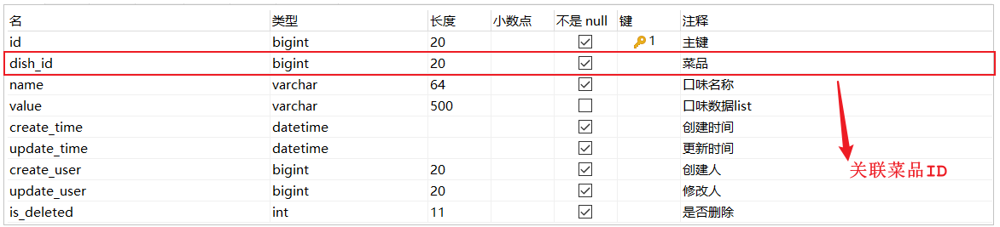

# 文件上传和下载
    设置文件上传路径
```yaml
reggie:
  #使用自己电脑的路径
  #文件路径：C:\Users\meng\Desktop\新建文件夹\img
  path: C:\Users\meng\Desktop\新建文件夹\img
```
## 上传
```java
package com.itmhw.contorller;

import com.baomidou.mybatisplus.core.conditions.update.LambdaUpdateWrapper;
import com.itmhw.common.GlobalConstart;
import com.itmhw.common.R;
import com.itmhw.entity.Category;
import com.itmhw.service.CategoryService;
import lombok.extern.slf4j.Slf4j;
import org.apache.commons.lang.StringUtils;
import org.springframework.beans.factory.annotation.Autowired;
import org.springframework.beans.factory.annotation.Value;
import org.springframework.http.MediaType;
import org.springframework.stereotype.Service;
import org.springframework.web.bind.annotation.GetMapping;
import org.springframework.web.bind.annotation.PostMapping;
import org.springframework.web.bind.annotation.RequestMapping;
import org.springframework.web.bind.annotation.RestController;
import org.springframework.web.multipart.MultipartFile;

import javax.servlet.ServletOutputStream;
import javax.servlet.http.HttpServletResponse;
import java.io.File;
import java.io.FileInputStream;
import java.io.IOException;
import java.util.List;
import java.util.UUID;

/**
 * 菜品分类
 *
 * @author mhw
 * @since 2022/11/4 11:11
 */
@RestController
@RequestMapping("/common")
@Slf4j
public class CommonController {

    @Value("${reggie.path}")
    private String bassPath;

    /**
     * 文件的上传
     * @param file
     * @return
     */
    @PostMapping("/upload")
    public R<String> upload(MultipartFile file){
        if (file == null || StringUtils.isBlank(file.getOriginalFilename())){
            return R.error(GlobalConstart.ERROR);
        }
        //获取文件名
        String filename = file.getOriginalFilename();
        //获取 . 的位置
        int index = filename.lastIndexOf(".");
        //获取 . 后面的文件后缀
        String substring = filename.substring(index);
        //使用UUID重新生成图片文件名
        String uuid = UUID.randomUUID().toString();
        //进行拼接，获取一个新的文件名
        String newFileName = uuid + substring;
        //创建图片保存的基本目录
        /*
        new File的时候不会在硬盘中真正的创建路径的，
        这里只是在内存中创建了File对象
        如果在new file的时候就创建了我们指定的路径或者文件
         */
        File dir = new File(bassPath);
        //判断路径是否存在
        //如果不存在，就来创建这个文件夹
        if (!dir.exists()){
            dir.mkdirs();
        }
        //保存到临时文件到图片目录下
        try {
            //文件转移
            //file ===> bassPath路径下，并且文件名是newFileName
            file.transferTo(new File(bassPath,newFileName));
        } catch (IOException e) {
            throw new RuntimeException(e);
        }
        //返回新图片文件名
        return R.success(newFileName);
    }
}
```
## 下载
```markdown
这个文件下载的中，图片的显示必须是图片在下载路径中才会显示
```
```java
 /**
     * 文件的下载
     */
    @GetMapping("/download")
    public void download(String name, HttpServletResponse response){
        try {
            //1、定义输入流，通过输入流读取文件内容
            File file = new File(bassPath, name);
            //拿到了我们要用的文件
            FileInputStream fileInputStream = new FileInputStream(file);
            //2、通过response对象响应数据格式(image/jpeg)
            //使用spring包下的MediaType这个方法 MediaType.IMAGE_JPEG_VALUE 等价于 "image/jpeg"
            //3、response.setContentType(MediaType.IMAGE_JPEG_VALUE);
            response.setContentType("image/jpeg");
            //通过response对象获取到输出流
            ServletOutputStream outputStream = response.getOutputStream();
            //4、通过输入流读取文件数据，然后通过输出流写回浏览器
            //4、1读取数据的长度
            int length = 0;
            //4、2通常都会通过每次王浏览器发送1kb的方式写回浏览器中
            //这样可以避免如果返回大数据量的话，浏览器出问题
            byte[] bytes = new byte[1024];
            //fileInputStream.read(bytes) 读取文件时，如果返回的是-1，就代表文件读完了
            //读完之后，跳出循环体即可
            while ((length = fileInputStream.read(bytes))!=-1){
                //写文件到浏览器中
                outputStream.write(bytes,0,length);
                outputStream.flush();
            }
            //5、关闭浏览器资源(仅关闭本地文件流即可)
            fileInputStream.close();
        } catch (IOException e) {
            throw  new RuntimeException(e);
        }
    }
```
# 新增

```markdown
相关联的表
```
| 表结构      | 说明       |
| ----------- | ---------- |
| dish        | 菜品表     |
| dish_flavor | 菜品口味表 |
    菜品表


    菜品口味表

```markdown
当一个新增中有两个表的内容的时候，我们这时候应该怎么去接数据，如果使用一个类去接，而一个类对应一个表，这时候数据怎么接
这时候我们一般可以创建一个实体类的子类，用子类来接，哪个表要什么数据在分开给
```
    创建一个后面名为dto的类：DishDto
```java
package com.itmhw.dto;

import com.itmhw.entity.Dish;
import com.itmhw.entity.DishFlavor;
import lombok.Data;
import java.util.ArrayList;
import java.util.List;

@Data
public class DishDto extends Dish {

    /**
     * 菜品口味信息
     */
    private List<DishFlavor> flavors = new ArrayList<>();

    /**
     * 分类名称
     */
    private String categoryName;
    /**
     * 份数
     */
    private Integer copies;
}
```
    实体类
```java
package com.itmhw.entity;

import com.baomidou.mybatisplus.annotation.FieldFill;
import com.baomidou.mybatisplus.annotation.IdType;
import com.baomidou.mybatisplus.annotation.TableField;
import com.baomidou.mybatisplus.annotation.TableId;
import lombok.Data;
import java.io.Serializable;
import java.math.BigDecimal;
import java.time.LocalDateTime;

/**
 菜品
 */
@Data
public class Dish implements Serializable {

    private static final long serialVersionUID = 1L;

    private Long id;


    //菜品名称
    private String name;


    //菜品分类id
    private Long categoryId;


    //菜品价格
    private BigDecimal price;


    //商品码
    private String code;


    //图片
    private String image;


    //描述信息
    private String description;


    //0 停售 1 起售
    private Integer status;


    //顺序
    private Integer sort;


    @TableField(fill = FieldFill.INSERT)
    private LocalDateTime createTime;


    @TableField(fill = FieldFill.INSERT_UPDATE)
    private LocalDateTime updateTime;


    @TableField(fill = FieldFill.INSERT)
    private Long createUser;


    @TableField(fill = FieldFill.INSERT_UPDATE)
    private Long updateUser;

}
```
    DisController表示层
```java
package com.itmhw.contorller;

import com.baomidou.mybatisplus.core.conditions.update.LambdaUpdateWrapper;
import com.baomidou.mybatisplus.extension.plugins.pagination.Page;
import com.itmhw.common.GlobalConstart;
import com.itmhw.common.R;
import com.itmhw.dto.DishDto;
import com.itmhw.entity.Category;
import com.itmhw.entity.Dish;
import com.itmhw.service.CategoryService;
import com.itmhw.service.IDishService;
import lombok.extern.slf4j.Slf4j;
import org.apache.commons.lang.StringUtils;
import org.springframework.beans.BeanUtils;
import org.springframework.beans.factory.annotation.Autowired;
import org.springframework.web.bind.annotation.*;

import java.util.ArrayList;
import java.util.List;

/**
 * 菜品表示层
 *
 * @author mhw
 * @since 2022/11/4 17:20
 */
@RestController
@RequestMapping("/dish")
@Slf4j
public class DisController {

    @Autowired
    private IDishService dishService;

    @Autowired
    private CategoryService categoryService;

    /**
     * 套餐中查询菜品
     */
    @GetMapping("/list")
    public R<List<Dish>> list(Dish dish){
        LambdaUpdateWrapper<Dish> lambdaUpdateWrapper = new LambdaUpdateWrapper<>();
        lambdaUpdateWrapper.eq(dish.getCategoryId() > 0,Dish::getCategoryId,dish.getCategoryId());
        //添加条件，查询状态为1（起售状态）的菜品
        lambdaUpdateWrapper.eq(Dish::getStatus,1);
        //添加排序条件
        lambdaUpdateWrapper.orderByAsc(Dish::getSort).orderByDesc(Dish::getUpdateTime);
        List<Dish> list = this.dishService.list(lambdaUpdateWrapper);
        return R.success(list);
    }


    /**
     * 添加菜品
     */
    @PostMapping
    public R<String> save(@RequestBody DishDto dishDto){
        this.dishService.saveWithFlavor(dishDto);
        return R.success(GlobalConstart.SUCCESS);
    }

    /**
     * 修改菜品
     */
    @GetMapping("/{id}")
    public R<DishDto> findById(@PathVariable Long id){
        DishDto dishDto = this.dishService.getByIdWithFlavor(id);
        return R.success(dishDto);
    }

    @PutMapping
    public R<String> update(@RequestBody DishDto dishDto){
        this.dishService.updateWithFlavor(dishDto);
        return R.success(GlobalConstart.SUCCESS);
    }


    /**
     * 分页查询
     */
    @GetMapping("/page")
    public R<Page<DishDto>> getPage(Integer page,Integer pageSize,String name){
        //1、构造分页条件对象
        Page<Dish> queryPage = new Page<>();
        //当前页
        queryPage.setCurrent(page);
        //查询条数
        queryPage.setSize(pageSize);
        //构建查询及排序条件
        LambdaUpdateWrapper<Dish> queryWrapper = new LambdaUpdateWrapper<>();
        //name查询条件
        queryWrapper.like(StringUtils.isNotBlank(name), Dish::getName,name);
        //根据修改时间排序
        //用户体验方面的考虑
        queryWrapper.orderByDesc(Dish::getUpdateTime);
        //3、执行分页条件查询
        Page<Dish> dishPage = this.dishService.page(queryPage, queryWrapper);
        //4、构建返回结果对象，并copy查询结构到改对象中
        Page<DishDto> result = new Page<>();
        BeanUtils.copyProperties(dishPage,result,"records");
        //5、遍历分页查询列表数据，把Dish对象转为DishDto对象，同时赋值分类名称
        //这里存放的是所有我们要返回的数据
        List<DishDto> records = new ArrayList<>();
        for (Dish dish : dishPage.getRecords()) {
            DishDto dishDto = new DishDto();
            BeanUtils.copyProperties(dish,dishDto);
            //查询分类
            Category byId = this.categoryService.getById(dish.getCategoryId());
            if (byId != null){
                dishDto.setCategoryName(byId.getName());
            }
            records.add(dishDto);
        }
        result.setRecords(records);
        return R.success(result);
    }
}
```
    IDishService业务接口层
```java
package com.itmhw.service;

import com.baomidou.mybatisplus.extension.service.IService;
import com.itmhw.dto.DishDto;
import com.itmhw.entity.Dish;

/**
 * 菜品业务层
 *
 * @author t3rik
 * @since 2022/11/2 16:46
 */
public interface IDishService extends IService<Dish> {
    void saveWithFlavor(DishDto dishDto);

    DishDto getByIdWithFlavor(Long id);

    void updateWithFlavor(DishDto dishDto);
}

```
    DishServiceImpl业务实现层
```java
 package com.itmhw.service.impl;

import com.baomidou.mybatisplus.core.conditions.update.LambdaUpdateWrapper;
import com.baomidou.mybatisplus.extension.service.impl.ServiceImpl;
import com.itmhw.dto.DishDto;
import com.itmhw.entity.Dish;
import com.itmhw.entity.DishFlavor;
import com.itmhw.mapper.DishMapper;
import com.itmhw.service.IDishFlavorService;
import com.itmhw.service.IDishService;
import org.springframework.beans.BeanUtils;
import org.springframework.beans.factory.annotation.Autowired;
import org.springframework.stereotype.Service;

import java.util.List;

/**
 * 菜品业务层实现类
 *
 * @author t3rik
 * @since 2022/11/2 16:47
 */
@Service
public class DishServiceImpl extends ServiceImpl<DishMapper, Dish> implements IDishService {


    @Autowired
    private IDishFlavorService dishFlavorService;

    /**
     * 查询菜品
     * @param id
     * @return
     */

    @Override
    public DishDto getByIdWithFlavor(Long id) {
        //查询菜品信息
        Dish dish = this.getById(id);
        //构建Disdto,把dish对象复制到DisDto对象
        DishDto dishDto = new DishDto();
        BeanUtils.copyProperties(dish,dishDto);
        //查询菜品对应的口味
        /*
        注意的是这里为什么要使用list查询一个list集合而不用getById：
            因为：dishDto.setFlavors()方法接收的是list集合
         */
        LambdaUpdateWrapper<DishFlavor> queryWrapper = new LambdaUpdateWrapper<>();
        //查询条件
        queryWrapper.eq(DishFlavor::getDishId,dish.getId());
        //对dishFlavor表进行查询
        List<DishFlavor> dishFlavorList = this.dishFlavorService.list(queryWrapper);
        //将口味信息写入dishDto类中输出
        dishDto.setFlavors(dishFlavorList);
        return dishDto;
    }

    /**
     * 修改菜品
     * @param dishDto
     */
    @Override
    public void updateWithFlavor(DishDto dishDto) {
        //1、更新地上表
        //1.1、先将dishDto中的ish属性提取
        Dish dish = new Dish();
        BeanUtils.copyProperties(dishDto,dish);
        //1.2、将dish表进行修改
        this.getById(dish);
        //2、将dishFlavor表中想关联的口味数据删除
        //更加dish菜品ID删除dishFlavor口味表中数据
        LambdaUpdateWrapper<DishFlavor> queryWrapper = new LambdaUpdateWrapper<>();
        queryWrapper.eq(DishFlavor::getDishId,dish.getId());
        this.dishFlavorService.remove(queryWrapper);
        //3.要给flavors 口味表中的dishId赋值
        for (DishFlavor flavor : dishDto.getFlavors()) {
            flavor.setDishId(dish.getId());
        }
        //4.新增口味
        this.dishFlavorService.saveBatch(dishDto.getFlavors());
    }

    /**
     * 增加菜品
     * @param dishDto
     */
    @Override
    public void saveWithFlavor(DishDto dishDto) {
        //1、保存菜品基本信息
        Dish dish = new Dish();
        //将dishDto中的dish信息赋值给dish
        BeanUtils.copyProperties(dishDto,dish);
        //写入数据库中
        this.save(dish);
        //2、保存菜品口味信息
        Long dishId = dish.getId();
        if (dishDto.getFlavors().size()>0){
            for (DishFlavor flavor : dishDto.getFlavors()) {
                //菜品ID
                flavor.setDishId(dishId);
            }
            //调用保存菜品口味信息
            this.dishFlavorService.saveBatch(dishDto.getFlavors());
        }
    }
}
```