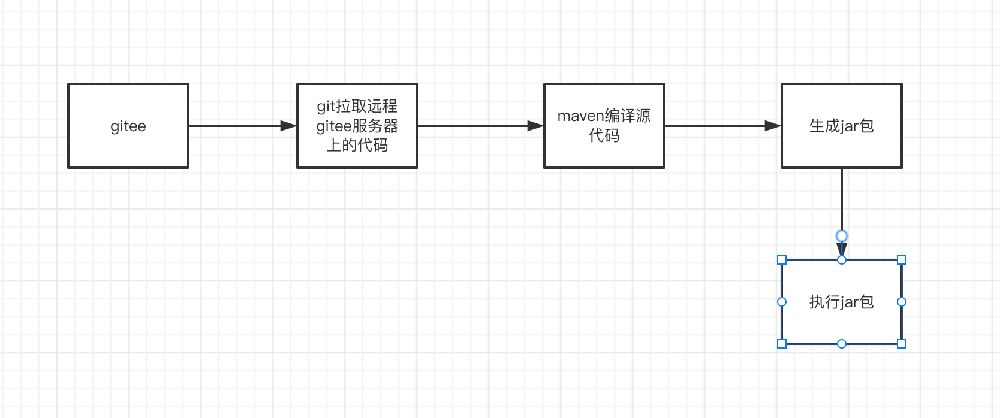
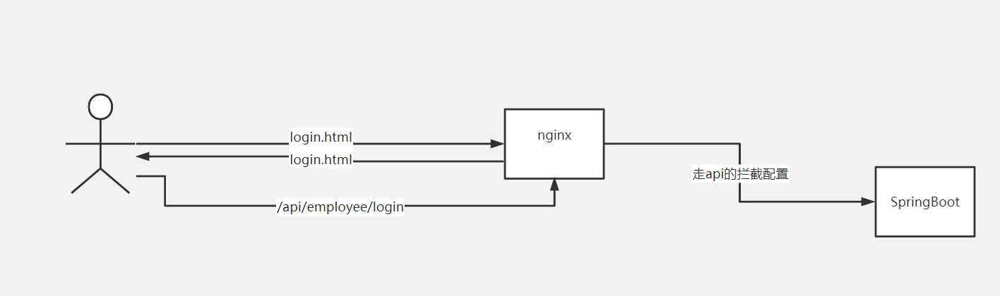
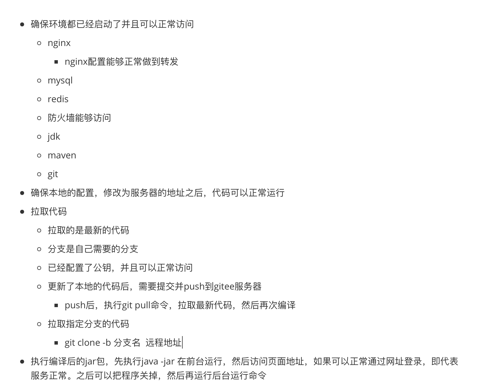
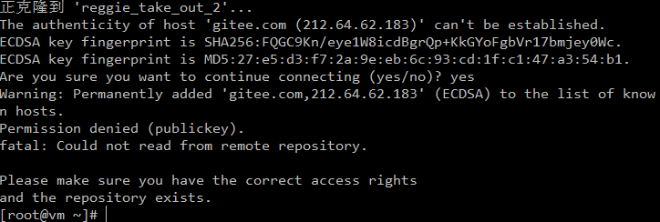

# 思路图


# 步骤图

# 查询相关的程序是否启动
```shell
# redis 可以换成要查询的程序
ps -ef | grep redis
```
# Nginx启动
    要进入Nginx文件中的sbin文件中输入一下内容：
```shell
# 进入Nginx文件中的sbin文件
cd nginx/sbin
# 运行方式
./nginx
# 如果要修改Nginx的配置问题的要进入Nginx文件中的conf文件中
cd nginx/conf
# 修改nginx.conf文件,可以通过vim直接修改，也可下载下来修改，然后传输上去
vim nginx.conf
# 修改了nginx.conf以后要重启服务,要执行一下命令，同样必须在sbin文件中
cd ../sbin
./nginx -s reload
```
## 反向代理配置
```shell
  upstream boot{
        # 200.1 宿主机
        server 192.168.200.138:8080;
        #server 192.168.200.129:8080;
  }
  server {
        listen       80;
        server_name  localhost;

        location / {
            root   html;
            index  index.html;
        }
		# http://192.168.188.128/api/employee/login
		# 会被这个配置拦截住
		location ^~ /api/ {
			# 重定向的操作	
			# /employee/login
			rewrite ^/api/(.*)$ /$1 break;
			# http://192.168.200.138:8080/employee/login
			proxy_pass http://boot;
		}
		
        location = /50x.html {
            root   html;
        }
    }
```
    其中一下一段为反向配置
```shell
upstream boot{
        # 200.1 宿主机
        server 192.168.200.138:8080;
        #server 192.168.200.129:8080;
}

location ^~ /api/ {
    rewrite ^/api/(.*)$ /$1 break;
    proxy_pass http://boot;
}
```
1. 路径重写
```shell
rewrite ^/api/(.*)$ /$1 break;
```
```markdown
这里写的是一个正则表达式，代表如果请求路径是以 `/api/` 开头，后面的请求路径任意， 
此时将原始的url路径重写为 `/$1`，这里的`$1`指代的就是通配符 .* 这一块的内容。
比如：
```
```markdown
/api/employee/login ------> ^/api/(.*)$ --------> 此时 (.*) 匹配的就是 employee/login ------> 最终重写为/$1 : /employee/login
```
2. 反向代理
```shell
proxy_pass http://boot;
```
```markdown
boot是一个虚拟名称的代表，代表是就是前面定义的upstream boot 。boot 代表是一个机器的集群。可以根据负载策略随机选择一台。如果仅有一台直接转发到这台主机。

路径重写后的请求，将会转发到后端的 http://192.168.200.138:8080 服务器中。
```
# 打开防火墙中Nginx对外服务的接口
```shell
#开放端口
firewall-cmd --zone=public --add-port=80/tcp --permanent
#重新加载配置
firewall-cmd --reload
```
# 查看Java版本
```shell
java -version
```
# 打开mysql(这里是mariadb)
```shell
systemctl start mariadb 
```
# 查看mysql启动没有(这里是mariadb)
```shell
systemctl status mariadb
```
# 打开防火墙中mysql对外服务的接口
```shell
# 开放端口命令
firewall-cmd --zone=public --add-port=3306/tcp --permanent
#重新加载配置
firewall-cmd --reload
```
# 打开redis
    要进入redis文件中的src文件中运行
```shell
cd /usr/local/redis-3.2.9/src
./redis-server  # 运行服务器
./redis-cli  # 运行客户端
```
## redis的配置
    要进入redis文件中对redis.conf进行修改,也可以拉下在外面修改，然后传输上去
```shell
cd /usr/local/redis-3.2.9
vim redis.conf
```
# 打开防火墙中redis对外服务的接口
```shell
#.开放端口
firewall-cmd --zone=public --add-port=6379/tcp --permanent
#重新加载配置
firewall-cmd --reload
```
# 查看maven版本(这里版本尽量不低于3.5.4)
```shell
mvn -v
```
# 使用git
## 生成公钥及配置
1. 生成公钥
```shell
ssh-keygen -t ed25519 -C "xxxxx@xxxxx.com"  
```
2. 查看公钥
```shell
cat ~/.ssh/id_ed25519.pub
```
3. 部署公钥
```markdown
将生成的公钥放到自己的远端仓库中去
```
## git分支拉取远程仓库服务器上的代码
```shell
# git master主分支拉取：git clone 远端地址
# git clone -b 远端分支名 远端地址
 git clone -b makezero git@gitee.com:sky-zero/reggin_p1.git
```
## git拉取远程修改的内容
1. 进入文件夹中
2. 拉取代码
```shell
# 1. reggie_take_out这个为从远端拉取的文件夹
cd ~/reggie_take_out
# 2. 
git pull
```
    出现以下内容则证明拉取成功

## 编译
```shell
# 进入项目目录
cd ~/reggie_take_out
# 执行一下命令
mvn clean package -Dmaven.test.skip=true
# 此步骤想到maven中的clean，package方式
```
## 运行生成的jar包
```markdown
注意的是一下命令需要在jar文件中运行，一般Java中运行jar包在  项目文件中的target文件中
```
```shell
 cd ~/reggin_p1/target
```
## 前台运行
```shell
# reggie_take_out-1.0-SNAPSHOT.jar为打包好的文件
java -jar reggie_take_out-1.0-SNAPSHOT.jar
```
## 后台运行
```shell
# reggie_take_out-1.0-SNAPSHOT.jar 为运行的jar包
# reggie_take_out.log ：后台生成需要日志显示，这个为日志文件
nohup java -jar reggie_take_out-1.0-SNAPSHOT.jar &> reggie_take_out.log &
```
## 查看日志
```shell
# tail 方式为从文件末尾查看
# -f 为实时更新
tail -f reggie_take_out.log
```
